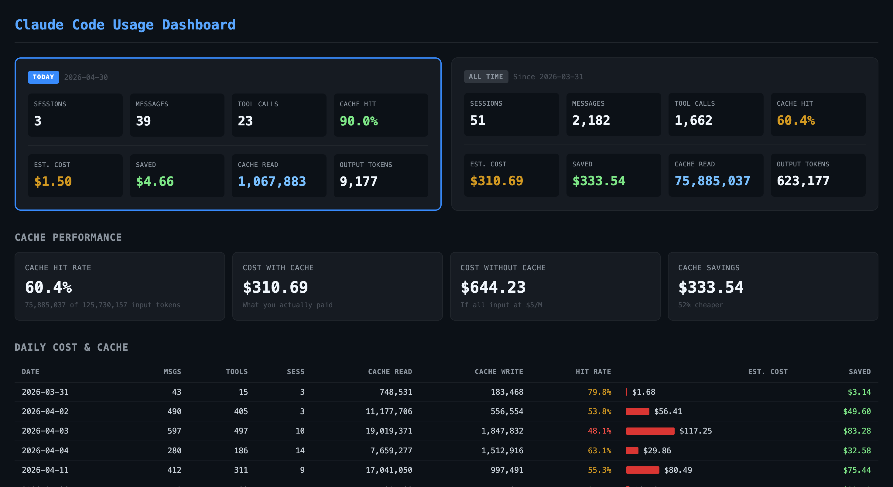

# claude-lens

A local dashboard for visualizing your [Claude Code](https://claude.ai/code) usage — sessions, token costs, cache performance, tool calls, and daily breakdowns.



## Features

- **Today vs All-Time stats** — sessions, messages, tool calls, estimated cost
- **Cache performance** — hit rate, savings vs no-cache baseline
- **Daily cost & cache table** — per-day token breakdown with estimated spend
- **Tool call analytics** — which tools Claude used most, across all projects
- **Auto-detected data directory** — finds your Claude Code data folder on Windows, macOS, and Linux without configuration; falls back gracefully and tells you which paths it tried if nothing is found
- **Chat page** — a streaming chat UI at `/chat` that talks to your account models (Opus 4.7, Sonnet 4.6, Haiku 4.5) using your local OAuth token. No API key required — inference is billed against your existing Claude account quota. Multi-conversation history with a browser, multimodal uploads (images / PDFs / text via paperclip, drag-drop, or paste), and an advanced settings drawer for `max_tokens`, `temperature`, `top_p`, history budget, and a custom system addendum. The token stays server-side; the browser only sees the proxied response stream.
- **OpenAI-compatible API** — local `POST /v1/chat/completions` and `GET /v1/models` endpoints at `http://localhost:3456/v1`. Lets the official `openai` Python / Node SDKs (and any other client that speaks OpenAI's wire format) call your local Claude account by just changing `base_url`. Streaming, system messages, and multimodal `image_url` blocks (data URLs and remote URLs) are translated automatically. The dedicated [/api page](http://localhost:3456/api) bundles a request playground, copy-pasteable cURL / Python / Node snippets, and a full reference of which OpenAI fields are supported.
- **Account page** — a separate `/account` view showing your full Claude account state. Reads `.credentials.json` for the OAuth token (server-side only) and calls `api.anthropic.com/api/oauth/profile` to fetch your full name, display name, email, account creation date, plan flags (Claude Max / Pro), organization name and type, billing method, subscription status and start date, rate-limit tier, seat tier, extra-usage flag, Claude Code trial state, plus the OAuth application name/slug, token expiry countdown, and scopes. Remote response is cached for 60s. Access and refresh tokens never reach the browser — only an explicit allow-list of safe fields is forwarded.
- **Light & dark mode** — theme toggle in the header, follows your OS preference by default and remembers your choice
- **System-timezone aware** — daily totals are bucketed by your local date (not UTC), and the active timezone is displayed in the header
- **Configurable pricing** — swap between Bedrock and Anthropic API rates via `.env`

## Requirements

- Node.js 18+
- Claude Code installed (data lives in `~/.claude`)

## Quick start

No install needed — run directly from GitHub:

```bash
npx github:foyzulkarim/claude-lens
```

Then open [http://localhost:3456](http://localhost:3456). The server auto-detects your Claude data directory, so usually no configuration is needed.

## Local setup

```bash
git clone https://github.com/foyzulkarim/claude-lens.git
cd claude-lens
npm install
cp .env.example .env
```

`CLAUDE_DIR` is optional — if you don't set it, claude-lens auto-detects your Claude data directory (see [CLAUDE_DIR auto-detection](#claude_dir-auto-detection) below).

```bash
node server.js
```

Open [http://localhost:3456](http://localhost:3456).

## Configuration

All options are set via `.env`:

| Variable           | Default      | Description                                   |
|--------------------|--------------|-----------------------------------------------|
| `CLAUDE_DIR`       | auto-detected | Path to Claude data directory (override only) |
| `RATE_INPUT`       | `5.0`        | Input token price (USD per 1M)                |
| `RATE_OUTPUT`      | `25.0`       | Output token price (USD per 1M)               |
| `RATE_CACHE_READ`  | `0.5`        | Cache read price (USD per 1M)                 |
| `RATE_CACHE_CREATE`| `6.25`       | Cache write price (USD per 1M)                |
| `LOCAL_API_KEY`    | unset        | Optional bearer token gating `/v1/*`. Unset → no auth (trusts localhost). Set this if you forward port 3456 outside your machine. |

Default rates match **Bedrock cross-region inference (ap-southeast-2)**. For Anthropic API rates use `RATE_INPUT=15`, `RATE_OUTPUT=75`, `RATE_CACHE_READ=1.5`, `RATE_CACHE_CREATE=18.75`.

### Calling the OpenAI-compatible API

The server speaks OpenAI's Chat Completions wire format at `http://localhost:3456/v1`, so any client that already supports OpenAI works by just changing `base_url`. Inference is billed against your local Claude account quota — there's no separate Anthropic API key.

#### Python (text only)

```python
# pip install openai
from openai import OpenAI

client = OpenAI(base_url="http://localhost:3456/v1", api_key="sk-not-required")
resp = client.chat.completions.create(
    model="claude-haiku-4-5-20251001",
    messages=[{"role": "user", "content": "Hello!"}],
)
print(resp.choices[0].message.content)
```

#### Python (text + image, local file)

```python
import base64
from openai import OpenAI

client = OpenAI(base_url="http://localhost:3456/v1", api_key="sk-not-required")
with open("diagram.png", "rb") as f:
    b64 = base64.b64encode(f.read()).decode()

resp = client.chat.completions.create(
    model="claude-haiku-4-5-20251001",
    messages=[{
        "role": "user",
        "content": [
            {"type": "image_url", "image_url": {"url": f"data:image/png;base64,{b64}"}},
            {"type": "text",      "text": "What's in this image?"},
        ],
    }],
    max_tokens=512,
)
print(resp.choices[0].message.content)
```

Remote images work too — pass `{"url": "https://example.com/photo.jpg"}` instead of a `data:` URL.

#### Node (streaming)

```js
// npm install openai
import OpenAI from 'openai';

const client = new OpenAI({ baseURL: 'http://localhost:3456/v1', apiKey: 'sk-not-required' });
const stream = await client.chat.completions.create({
  model: 'claude-sonnet-4-6',
  messages: [{ role: 'user', content: 'Tell me a haiku about Bengal tigers.' }],
  stream: true,
});
for await (const chunk of stream) {
  process.stdout.write(chunk.choices[0].delta.content || '');
}
```

#### cURL

```bash
curl http://localhost:3456/v1/chat/completions \
  -H "Content-Type: application/json" \
  -d '{"model":"claude-haiku-4-5-20251001","messages":[{"role":"user","content":"Hello!"}]}'
```

#### Playground

For a hands-on test, open [http://localhost:3456/api](http://localhost:3456/api) — it's a live request builder with image attachments, copy-pasteable cURL / Python / Node / fetch snippets that auto-update from the form, and a full reference of supported / unsupported fields. Use it to verify your local setup before switching an existing client over.

#### What's translated, what's ignored

The translation layer covers everything most clients need: `messages[].role: "system"` → Anthropic's separate `system` field, multimodal `image_url` blocks (data URLs and remote URLs) → Anthropic `image` source blocks, `stop` → `stop_sequences`, finish-reason mapping, and SSE-to-OpenAI streaming chunks ending in `data: [DONE]`.

Currently dropped (silently — a warning appears in the `X-Claude-Lens-Warnings` response header): `frequency_penalty`, `presence_penalty`, `logit_bias`, `seed`, `response_format`, `tools`, `tool_choice`, `n > 1`, `logprobs`, `top_logprobs`, `service_tier`. Anthropic doesn't expose these — your client may set them, but the model won't see them. Function calling (`tools`) isn't yet plumbed through and will likely arrive in a future release.

### CLAUDE_DIR auto-detection

If `CLAUDE_DIR` isn't set (or points somewhere invalid), claude-lens tries these locations in order and uses the first one that looks like a Claude Code data directory:

1. `~/.claude`
2. **Windows:** `%APPDATA%\Claude`, `%APPDATA%\.claude`, `%LOCALAPPDATA%\Claude`, `%USERPROFILE%\.claude`
3. **macOS:** `~/Library/Application Support/Claude`
4. **Linux:** `$XDG_CONFIG_HOME/claude` (or `~/.config/claude`)

A directory is considered valid if it contains any of: `projects/`, `history.jsonl`, `sessions/`, or `stats-cache.json`. The active path and its source are shown in the dashboard header. If nothing valid is found, the dashboard shows an error banner listing every path that was tried — set `CLAUDE_DIR` in `.env` to point at the right one.

### Theme

A theme toggle in the top-right of the dashboard switches between light and dark mode. Defaults to your OS preference; your choice is stored in `localStorage` and survives reloads.
