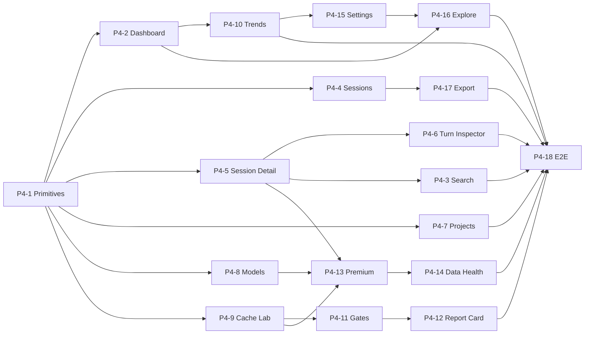

# Claude Lens — Phase 4 / 5 Parallelization Plan

Companion to `specs/claude-lens-plan.md` (the orchestrator). That doc lists every task in a single
sequential order "unless the dependency notes say otherwise." **This doc cashes in that clause:** it
separates the *real* dependencies from the *artificial* ordering ones and shows how to run Phase 4
as concurrent tracks to compress wall-clock time.

> Nothing here changes scope, acceptance criteria, or the plan's task list. It is a scheduling view
> only. The plan doc remains authoritative on *what* each task delivers.

---

## Why this doc exists

The plan lists `#P4-1 → #P4-2 → … → #P4-18` as one chain, but the plan itself flags the opportunity:
*"after #P4-2, remaining pages could parallelize, but sequential is fine."* Pages in this app are
cheap by design (filter state + preset `MetricsQuery`s + layout over a shared engine), and the shared
data plumbing is already built — so most of the chain is ordering-for-convenience, not a real gate.
Running the independent work concurrently is the single biggest lever on delivery time for Phase 4.

---

## The core distinction: two kinds of dependency

Every issue's `Depends on:` field mixes two very different things. Telling them apart is the whole game.

| | **Functional dep (hard)** | **Phase-ordering dep (soft)** |
|---|---|---|
| Meaning | B literally can't work until A ships — B reuses A's code, upgrades A's page, or drills into A's route | The plan just listed them in a chain for convenience |
| Can you break it? | No | Yes, freely |
| How to spot it | The note names a concrete reuse/upgrade/route | The note says "sequential ordering only", "phase ordering", "no functional dependency on…" |

Almost the entire `#P4-4 → #P4-5 → … → #P4-10` page chain is **soft**. The real graph is far wider.

---

## Verified foundation (already built)

Checked against the codebase (2026-07-16). The shared data layer pages depend on is **done**, which is
why pages don't contend on data access:

- ✅ **Metrics engine API** — `POST /api/metrics` (`server/routes/metrics.ts`), read-only shared surface.
- ✅ **Store read surface** — `server/store/store.ts` exposes `listSessions()`, `listCalls()`,
  `listTurns()`, and per-session `getSession/getTurns/getCalls`. Pages read what they need; no new
  accessors required.
- ✅ **Client route stubs** — `#P3-2` scaffolded all 11 page routes + the query-key factory in
  `App.tsx`, so each page fills its own stub rather than fighting over routing.

What is **not** yet built: the per-page HTTP routes (each owned by its page task — see the table).

---

## Functional dependency table (Phase 4)

Only **hard** predecessors are listed. Soft phase-ordering links are dropped.

| Task | Real predecessors | Owns route(s) | Notes |
|---|---|---|---|
| **#P4-1** Shared primitives | #P3-5, #P1-4 | — | **Universal gate** — every page uses stat-card / data-table / tier-badge |
| **#P4-2** Dashboard | #P4-1 | — | Pattern-setter page; also the target of #P4-10 & #P4-16 cross-writes |
| **#P4-3** Search | #P4-1, (#P4-5 link, stubbable) | `GET /api/search-index` | Route buildable early; wire deep-link when #P4-5 lands |
| **#P4-4** Sessions | #P4-1 | `GET /api/sessions` | — |
| **#P4-5** Session Detail | #P4-1 | `GET /api/sessions/:id` | — |
| **#P4-6** Turn Inspector | #P4-1, **#P4-5** | `GET /api/sessions/:id/turns/:n`, `/transcript` | Drills from Session Detail |
| **#P4-7** Projects | #P4-1 | — | Gate-pass-rate column stubs until #P4-11 |
| **#P4-8** Models | #P4-1 | — | Latency/throughput 🟡 until #P4-13 |
| **#P4-9** Cache Lab | #P4-1 | — | Builds the **miss-attribution classifier** reused by gate K2 |
| **#P4-10** Trends / Budget | #P4-1, **#P4-2** | `GET/PUT /api/config` (budget-only) | Cross-writes threshold alert onto Dashboard |
| **#P4-11** Gates engine | **#P4-9** (classifier) | — | Unblocks #P4-7's gate column and #P4-12 |
| **#P4-12** Report Card UI | **#P4-11** | — | — |
| **#P4-13** Premium tier | **#P4-5, #P4-8, #P4-9** (upgrade targets) + premium fixtures | — | #P4-12 dep is ordering-only |
| **#P4-14** Data Health | **#P4-13** (reconciliation needs premium) | `/api/health` | — |
| **#P4-15** Settings | **#P4-10** (extends its config store) | `/api/config`, `/api/views`, `/api/tags` | — |
| **#P4-16** Explore | **#P4-2** (pin saved-view) + **#P4-15** (config/tags) | — | — |
| **#P4-17** Export | **#P4-4** (export Sessions view) + #P3-3 (done) | `GET /api/export` | #P4-16 dep is ordering-only |
| **#P4-18** Cross-page E2E | **all pages + features** | — | Genuine terminal gate |

---

## Maximum-parallelism waves

Collapsing the graph by functional level (everything in a wave can run at once):

| Wave | Tasks | Width |
|---|---|---|
| **0** | #P4-1 | 1 (serial — blocks all) |
| **1** | #P4-2, #P4-4, #P4-5, #P4-7, #P4-8, #P4-9 | **6 parallel** |
| **2** | #P4-3, #P4-6, #P4-10, #P4-11, #P4-13, #P4-17 | up to **6 parallel** |
| **3** | #P4-12, #P4-14, #P4-15 | 3 parallel |
| **4** | #P4-16 | 1 |
| **5** | #P4-18 | 1 (serial — needs everything) |

**Critical path ≈ 6 stages** versus **18 fully serial.** Longest hard chains:

- `#P4-1 → #P4-9 → #P4-11 → #P4-12 → #P4-18`
- `#P4-1 → #P4-5 → #P4-13 → #P4-14 → #P4-18`
- `#P4-1 → #P4-10 → #P4-15 → #P4-16 → #P4-18`



---

## Recommended grouping: 4 tracks

Six-wide parallelism is more than most setups staff cleanly. A sane, low-conflict division:

**Serial spine first (do not parallelize):** `#P4-1 → #P4-2`. #P4-1 is the hard universal gate;
#P4-2 establishes the page pattern every other page copies. Landing it first stops six pages from
inventing six conventions.

Then run these four tracks concurrently:

| Track | Tasks (in-track order) | Starts after | Character |
|---|---|---|---|
| **A — Session drill-down** | #P4-4 → #P4-5 → #P4-6 → #P4-3 | spine | Tightly linked by drill navigation; keep in one lane |
| **B — Analytics pages** | #P4-7, #P4-8, #P4-9 → #P4-10 | spine | #P4-9 must land before Track C; #P4-10 waits on #P4-2 |
| **C — Gates & premium** | #P4-11 → #P4-12 → #P4-13 → #P4-14 | **#P4-9 (Track B)** | The longest hard-serial chain — the limiting tail |
| **D — Config & extras** | #P4-15 → #P4-16 → #P4-17 | #P4-10 (Track B) | #P4-15 extends #P4-10; #P4-16 needs #P4-2 |

**Merge point:** `#P4-18` (cross-page E2E) runs last, after every page and feature is in.

Scaling knob: with only 2 lanes, run **A + B** to completion, then **C + D**. With 3, add C once
#P4-9 lands. Track C's internal chain (gates → report card → premium → data health) is the floor on
total time no matter how many lanes you add.

---

## Shared-file conflict caveats

Parallel *branches* collide on files even when tasks are functionally independent.

**Backend is verified low-conflict.** The shared data plumbing already exists (see Foundation). The
per-page routes aren't built yet, but each touches only **one** shared file — `server/app.ts` — and
only to add a one-line `registerXRoute(app, store)`. Additive, trivial merge. Not a real conflict file.

1. **Dashboard page file** — #P4-2 builds it; #P4-10 (threshold alert) and #P4-16 (pin saved-view)
   write onto it. **The one genuine client merge point.** Sequence after #P4-2 and land one at a time.
2. **Config store** — #P4-10 creates `settings.ts` + `/api/config` (budget-only); #P4-15 extends it.
   Hard order #P4-10 → #P4-15; don't run concurrently.
3. **Shared primitives** — if a page needs a new primitive mid-flight it touches `client/components/`.
   Front-load anything foreseeable into #P4-1 to avoid cross-track edits.
4. **Low-risk / additive** — per-page routes (register line in `app.ts`), per-page Cypress specs,
   per-page preset `MetricsQuery`s, premium/gate fixtures (#P4-13 / #P4-11) — all additive files.
5. **Client routes already stubbed** (#P3-2) — pages fill their own stub, so `App.tsx` churn is minor.

---

## Phase 5 — fully serial, gated behind all of Phase 4

`#P5-1 Perf → #P5-2 Package hygiene → #P5-3 Docs → #P5-4 Publish`. Each strictly consumes the prior
task's output (perf numbers → package → documented package → publish). **Do not parallelize Phase 5.**
And #P5-1 depends on #P4-18, so Phase 5 can't begin until Phase 4 (including the terminal E2E gate) is done.

---

## Bottom line

- **Phase 4:** 18 tasks, but only **~6 sequential stages** on the critical path — roughly **two-thirds
  is parallelizable.** With 3–4 tracks you can substantially cut wall-clock. The hard floor is the
  gates → report-card → premium → data-health tail (#P4-11 → #P4-12 → #P4-13 → #P4-14) plus terminal #P4-18.
- **Phase 5:** 4 tasks, **strictly serial**, gated behind all of Phase 4.
- **Before spawning parallel work:** land **#P4-1 then #P4-2**, and treat the Dashboard page file and
  the config store as coordination points — everything else is a wide independent band.

---

## Execution playbook (worktrees + per-issue pipeline)

**Tracks are scheduling lanes, not branches.** This repo's delivery pipeline is strictly
per-issue (`/start-task <issue#>` → `/plan-architecture`/`/generate-tasks` as needed →
`/implement` → `/review` → `/commit` → PR with `Closes #N` → merge → `/archive-issue`), so
parallelism is achieved by running **several instances of that pipeline at once** — one git
worktree + one branch per in-flight issue, each cut from latest `main` and merged back
promptly. Long-lived stacked "track branches" would break the one-issue-one-PR flow; don't
use them. Short-lived branches are also what keep the parallel merges cheap.

### Task → GitHub issue mapping

All issues below are already filed (verified against `specs/issues/*.md` frontmatter).

| Plan task | Issue | | Plan task | Issue | | Plan task | Issue |
|---|---|---|---|---|---|---|---|
| #P3-5 (gates #P4-1) | #32 | | #P4-7 | #39 | | #P4-13 | #45 |
| #P4-1 | #33 | | #P4-8 | #40 | | #P4-14 | #46 |
| #P4-2 | #34 | | #P4-9 | #41 | | #P4-15 | #47 |
| #P4-3 | #35 | | #P4-10 | #42 | | #P4-16 | #48 |
| #P4-4 | #36 | | #P4-11 | #43 | | #P4-17 | #49 |
| #P4-5 | #37 | | #P4-12 | #44 | | #P4-18 | #50 |
| #P4-6 | #38 | | | | | #P5-1 … #P5-4 | #51 … #54 |

### Preconditions before opening parallel worktrees

1. **#32 (#P3-5 Cypress harness) closed** — every page task's definition of done includes a
   Cypress smoke spec, so the harness must exist first.
2. **#33 (#P4-1 primitives) merged to `main`** — serial, blocks all pages.
3. **#34 (#P4-2 Dashboard) merged** — pattern-setter; the parallel fan-out starts only after this.

### Worktree mechanics (per in-flight issue)

```bash
git fetch origin main
git worktree add ../claude-lens-p4-<n> -b feat/<issue#>/<slug> origin/main
# … work, PR, merge …
git worktree remove ../claude-lens-p4-<n>
```

- **One Claude session per worktree.** The start-time skills are user-invoked only
  (`disable-model-invocation: true`), so the user opens each session and runs
  `/start-task <issue#>` there; the session then follows the normal pipeline.
- Husky's pre-push (`npm run verify`) runs independently in each worktree — no extra setup.
- Per-issue artifacts are naturally conflict-free across worktrees: `specs/context/<N>.md`,
  `specs/issues/` records, and root `CODE-REVIEW-PR-<N>.md` are all keyed by issue/PR number.

### Concurrency rules (distilled from the dependency table)

- Never two of **{#P4-2, #P4-10, #P4-16}** in flight at once — all three write the Dashboard
  page file.
- **#P4-15 never in flight while #P4-10 is** — it extends #P4-10's config store.
- Hard start-gates: #P4-11 only after #P4-9 merges · #P4-12 after #P4-11 · #P4-13 after
  #P4-5 + #P4-8 + #P4-9 · #P4-14 after #P4-13 · #P4-16 after #P4-15 · #P4-6 after #P4-5 ·
  **#P4-18 last, alone** (no other Phase 4 work in flight).
- After any dependency merges to `main`, in-flight branches **rebase on `main`** before
  continuing.
- A page discovering it needs a **new shared primitive** lands it as a tiny separate PR to
  `client/components/` first, rather than inside the page branch — keeps cross-track edits
  out of page PRs.

### Launch sequence at 3 parallel slots (recommended width)

"Start X when Y merges." Slots fill greedily; Track C's chain is the tail to protect.

| Step | Start | When |
|---|---|---|
| 0 | #33 (#P4-1) | now — solo |
| 1 | #34 (#P4-2) | #33 merges — solo |
| 2 | #36 (Sessions) · #41 (Cache Lab) · #40 (Models) | #34 merges — fan-out begins |
| 3 | #43 (Gates) | #41 merges (frees a slot; classifier ready) |
| 4 | #37 (Session Detail) | #36 merges |
| 5 | #39 (Projects) | next free slot |
| 6 | #42 (Trends/Budget) | #34 already merged + free slot (Dashboard write — not with #48) |
| 7 | #44 (Report Card) | #43 merges |
| 8 | #38 (Turn Inspector) · #35 (Search) | #37 merges |
| 9 | #45 (Premium) | #37 + #40 + #41 all merged |
| 10 | #49 (Export) | #36 merged + free slot |
| 11 | #47 (Settings) | #42 merges |
| 12 | #46 (Data Health) | #45 merges |
| 13 | #48 (Explore) | #47 merges (Dashboard write — nothing else touching Dashboard in flight) |
| 14 | #50 (Cross-page E2E) | everything above merged — solo, closes the phase |

### Post-merge hygiene (every issue, every time)

1. Flip the task's checkbox in `specs/claude-lens-plan.md` (checkboxes flip when issues
   **close**, per the plan's own rule).
2. Run `/archive-issue` promptly — "PR merged, issue closed" is the trigger (CLAUDE.md
   standing rule; stale `specs/` files have already bitten twice).
3. `git worktree remove` the finished worktree; rebase the remaining in-flight branches.
