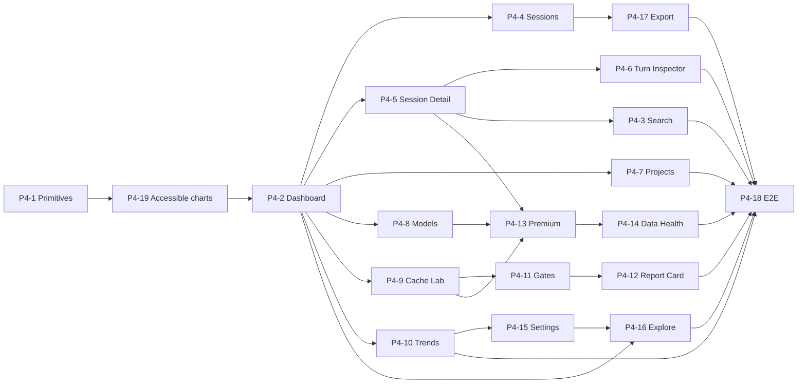

# Claude Lens — Phase 4 / 5 Parallelization Plan

Companion to `specs/claude-lens-plan.md` (the orchestrator). That doc lists every task in a single
sequential order "unless the dependency notes say otherwise." **This doc cashes in that clause:** it
separates the *real* dependencies from the *artificial* ordering ones and shows how to run Phase 4
as concurrent lanes to compress wall-clock time.

> Nothing here changes scope, acceptance criteria, or the plan's task list. It is a scheduling view
> only. The plan doc remains authoritative on *what* each task delivers.

---

## Why this doc exists

The plan lists Phase 4 in one reference order, but the plan itself flags the opportunity:
*"after #P4-2, remaining pages could parallelize, but sequential is fine."* Pages in this app are
cheap by design (filter state + preset `MetricsQuery`s + layout over a shared engine), and the shared
data plumbing is already built — so most of the chain is ordering-for-convenience, not a real gate.
Running the independent work concurrently is the single biggest lever on delivery time for Phase 4.

---

## The core distinction: two kinds of dependency

Every issue's `Depends on:` field mixes two very different things. Telling them apart is the whole game.

| | **Functional dep (hard)** | **Phase-ordering dep (soft)** |
|---|---|---|
| Meaning | B literally can't work until A ships — B reuses A's code, upgrades A's page, or drills into A's route | The plan just listed them in a chain for convenience |
| Can you break it? | No | Yes, freely |
| How to spot it | The note names a concrete reuse/upgrade/route | The note says "sequential ordering only", "phase ordering", "no functional dependency on…" |

Almost the entire `#P4-4 → #P4-5 → … → #P4-10` page chain is **soft**. The real graph is far wider.

---

## Verified foundation (already built)

Checked against the codebase (2026-07-16). The shared data layer pages depend on is **done**, which is
why pages don't contend on data access:

- ✅ **Metrics engine API** — `POST /api/metrics` (`server/routes/metrics.ts`), read-only shared surface.
- ✅ **Store read surface** — `server/store/store.ts` exposes `listSessions()`, `listCalls()`,
  `listTurns()`, and per-session `getSession/getTurns/getCalls`. Pages read what they need; no new
  accessors required.
- ✅ **Client route stubs** — `#P3-2` scaffolded all 11 page routes + the query-key factory in
  `App.tsx`, so each page fills its own stub rather than fighting over routing.

What is **not** yet built: the per-page HTTP routes (each owned by its page task — see the table).

---

## Functional dependency table (Phase 4)

Only **hard** predecessors are listed. Soft phase-ordering links are dropped.

| Task | Real predecessors | Owns route(s) | Notes |
|---|---|---|---|
| **#P4-1** Shared primitives | #P3-5, #P1-4 | — | **Universal gate** — every page uses stat-card / data-table / tier-badge |
| **#P4-19** Accessible charts | **#P4-1** | — | Shared chart boundary; must land before any page composes time-series charts |
| **#P4-2** Dashboard | **#P4-19** | — | Pattern-setter page; also the target of #P4-10 & #P4-16 cross-writes |
| **#P4-3** Search | **#P4-2**, **#P4-5** (deep-link target) | `GET /api/search-index` | Fills the stable search slot shipped by #P4-4 |
| **#P4-4** Sessions | **#P4-2** | `GET /api/sessions` | Ships the stable search slot before #P4-3 fills it |
| **#P4-5** Session Detail | **#P4-2** | `GET /api/sessions/:id` | — |
| **#P4-6** Turn Inspector | **#P4-5** | `GET /api/sessions/:id/turns/:n`, `/transcript` | Drills from Session Detail |
| **#P4-7** Projects | **#P4-2** | — | Gate-pass-rate column stubs until #P4-12 |
| **#P4-8** Models | **#P4-2** | — | Latency/throughput 🟡 until #P4-13 |
| **#P4-9** Cache Lab | **#P4-2** | — | Builds the **miss-attribution classifier** reused by gate K2 |
| **#P4-10** Trends / Budget | **#P4-2** | `GET/PUT /api/config` (budget-only) | Cross-writes threshold alert onto Dashboard |
| **#P4-11** Gates engine | **#P4-9** (classifier) | — | Unblocks #P4-12 |
| **#P4-12** Report Card UI | **#P4-11** | — | — |
| **#P4-13** Premium tier | **#P4-5, #P4-8, #P4-9** (upgrade targets) + premium fixtures | — | #P4-12 dep is ordering-only |
| **#P4-14** Data Health | **#P4-13** (reconciliation needs premium) | `/api/health` | — |
| **#P4-15** Settings | **#P4-10** (extends its config store) | `/api/config`, `/api/views`, `/api/tags` | — |
| **#P4-16** Explore | **#P4-2** (pin saved-view) + **#P4-15** (config/tags) | — | — |
| **#P4-17** Export | **#P4-4** (export Sessions view) + #P3-3 (done) | `GET /api/export` | #P4-16 dep is ordering-only |
| **#P4-18** Cross-page E2E | **all pages + features** | — | Genuine terminal gate |

---

## Maximum-parallelism waves

Collapsing the graph by functional level (everything in a wave can run at once):

| Wave | Tasks | Width |
|---|---|---|
| **0** | #P4-1 | 1 (serial — blocks all) |
| **1** | #P4-19 | 1 (serial — chart foundation) |
| **2** | #P4-2 | 1 (serial — page pattern) |
| **3** | #P4-4, #P4-5, #P4-7, #P4-8, #P4-9, #P4-10 | **6 parallel** |
| **4** | #P4-3, #P4-6, #P4-11, #P4-13, #P4-15, #P4-17 | up to **6 parallel** |
| **5** | #P4-12, #P4-14, #P4-16 | 3 parallel |
| **6** | #P4-18 | 1 (serial — needs everything) |

**Critical path ≈ 7 stages** versus **19 fully serial.** Longest start-condition chains:

- `#P4-1 → #P4-19 → #P4-2 → #P4-9 → #P4-11 → #P4-12 → #P4-18`
- `#P4-1 → #P4-19 → #P4-2 → #P4-5 → #P4-13 → #P4-14 → #P4-18`
- `#P4-1 → #P4-19 → #P4-2 → #P4-10 → #P4-15 → #P4-16 → #P4-18`

---

## Explicit parallel schedule (start-condition table)

> Supersedes the earlier "4 tracks" grouping (2026-07-17). Tracks implied *sequential within a
> lane*, which is stricter than the real graph and ambiguous to orchestrate. The contract below is
> exact: an issue may start the moment every issue in its **Starts after** column has **merged to
> `main`** (not merely started) and a lane is free. Any set of issues whose start conditions are
> satisfied may be in flight **simultaneously, in any combination** — the two mutexes (Dashboard
> file, config store) are already implied by these edges, so there are no hidden pairwise conflicts.

**Serial spine first (do not parallelize):** `#P4-1 → #P4-19 → #P4-2`. #P4-1 provides the
shared dashboard primitives, #P4-19 completes the accessible time-series boundary, and #P4-2
establishes the page pattern every other page copies.

| Start | Issue | Starts after (merged) | Role |
|---|---|---|---|
| #P4-1 | #33 | — | **solo** — blocks everything |
| #P4-19 Accessible charts | #84 | #33 | **solo** — chart foundation |
| #P4-2 | #34 | #84 | **solo** — pattern-setter |
| #P4-9 Cache Lab | #41 | #34 | **chain head** (gates chain) |
| #P4-10 Trends/Budget | #42 | #34 | **chain head** (config chain) |
| #P4-5 Session Detail | #37 | #34 | **chain head** (premium chain + drill pages) |
| #P4-8 Models | #40 | #34 | feeds #45 |
| #P4-4 Sessions | #36 | #34 | filler; feeds #49 |
| #P4-7 Projects | #39 | #34 | filler (leaf) |
| #P4-3 Search | #35 | #37 | filler (leaf) |
| #P4-6 Turn Inspector | #38 | #37 | filler (leaf) |
| #P4-17 Export | #49 | #36 | filler (leaf) |
| #P4-11 Gates engine | #43 | #41 | gates chain |
| #P4-12 Report Card | #44 | #43 | gates chain |
| #P4-13 Premium | #45 | #37 **and** #40 **and** #41 | premium chain |
| #P4-14 Data Health | #46 | #45 | premium chain |
| #P4-15 Settings | #47 | #42 | config chain |
| #P4-16 Explore | #48 | #47 | config chain |
| #P4-18 E2E | #50 | **all of #35–#49** | **solo** — nothing else in flight |

**Orchestration algorithm:** when a lane frees, start the ready issue with the longest unfinished
chain hanging off it. The three chains are equal-length critical paths (7 stages each from #33):

- **Gates chain:** #41 → #43 → #44 → (#50)
- **Premium chain:** {#37, #40, #41} → #45 → #46 → (#50)
- **Config chain:** #42 → #47 → #48 → (#50)

Everything else (#36, #39, #35, #38, #49) is filler — it absorbs idle lanes and never affects the
finish date. **Fan-out priority when #34 merges: #41 · #42 · #37 first** (the chain heads), then
#40, then fillers. Width beyond 3 lanes only drains filler earlier; the chains are the floor
regardless. Max useful width is 6, and only momentarily at fan-out.

---

## Shared-file conflict caveats

Parallel *branches* collide on files even when tasks are functionally independent.

**Backend is verified low-conflict.** The shared data plumbing already exists (see Foundation). The
per-page routes aren't built yet, but each touches only **one** shared file — `server/app.ts` — and
only to add a one-line `registerXRoute(app, store)`. Additive, trivial merge. Not a real conflict file.

1. **Dashboard page file** — #P4-2 builds it; #P4-10 (threshold alert) and #P4-16 (pin saved-view)
   write onto it. **The one genuine client merge point.** Sequence after #P4-2 and land one at a time.
2. **Config store** — #P4-10 creates `settings.ts` + `/api/config` (budget-only); #P4-15 extends it.
   Hard order #P4-10 → #P4-15; don't run concurrently.
3. **Shared primitives** — if a page needs a new primitive mid-flight it touches `client/components/`.
   Front-load anything foreseeable into #P4-1 to avoid cross-lane edits.
4. **Low-risk / additive** — per-page routes (register line in `app.ts`), per-page Cypress specs,
   per-page preset `MetricsQuery`s, premium/gate fixtures (#P4-13 / #P4-11) — all additive files.
5. **Client routes already stubbed** (#P3-2) — pages fill their own stub, so `App.tsx` churn is minor.

---

## Phase 5 — fully serial, gated behind all of Phase 4

`#P5-1 Perf → #P5-2 Package hygiene → #P5-3 Docs → #P5-4 Publish`. Each strictly consumes the prior
task's output (perf numbers → package → documented package → publish). **Do not parallelize Phase 5.**
And #P5-1 depends on #P4-18, so Phase 5 can't begin until Phase 4 (including the terminal E2E gate) is done.

---

## Bottom line

- **Phase 4:** 19 tasks, but only **~7 sequential stages** on the critical path — roughly **two-thirds
  is parallelizable.** With 3–4 lanes you can substantially cut wall-clock. The hard floor is the
  longest of the gates, premium, and config chains shown above, plus terminal #P4-18.
- **Phase 5:** 4 tasks, **strictly serial**, gated behind all of Phase 4.
- **Before Phase 4 execution:** merge **#85**, then land **#P4-1, #P4-19, and #P4-2**, and treat the Dashboard page file and
  the config store as coordination points — everything else is a wide independent band.

---

## Execution playbook (worktrees + per-issue pipeline)

**Lanes are scheduling slots, not branches.** This repo's delivery pipeline is strictly
per-issue (`/start-task <issue#>` → `/plan-architecture`/`/generate-tasks` as needed →
`/implement` → `/review` → `/commit` → PR with `Closes #N` → merge → `/archive-issue`), so
parallelism is achieved by running **several instances of that pipeline at once** — one git
worktree + one branch + one Claude session per in-flight issue, each cut from latest `main`
and merged back promptly. Long-lived stacked branches would break the one-issue-one-PR flow;
don't use them. Short-lived branches are also what keep the parallel merges cheap.

Two project skills own the worktree mechanics so `/start-task` (user-level, runs only in the
primary checkout) never has to change: `/move-to-worktree` opens a lane, `/finish-worktree`
closes it. `/start-task` itself commits `specs/context/<N>.md` on the branch before pushing,
so the context file travels with the branch into its worktree.

### Task → GitHub issue mapping

All Phase 4 issues below are filed. The parallel-execution infrastructure is tracked separately by
#85 and must merge before #33 starts.

| Plan task | Issue | | Plan task | Issue | | Plan task | Issue |
|---|---|---|---|---|---|---|---|
| #P3-5 (gates #P4-1) | #32 | | #P4-7 | #39 | | #P4-13 | #45 |
| #P4-1 | #33 | | #P4-8 | #40 | | #P4-14 | #46 |
| #P4-19 | #84 | | | | | | |
| #P4-2 | #34 | | #P4-9 | #41 | | #P4-15 | #47 |
| #P4-3 | #35 | | #P4-10 | #42 | | #P4-16 | #48 |
| #P4-4 | #36 | | #P4-11 | #43 | | #P4-17 | #49 |
| #P4-5 | #37 | | #P4-12 | #44 | | #P4-18 | #50 |
| #P4-6 | #38 | | | | | #P5-1 … #P5-4 | #51 … #54 |

### Preconditions before opening parallel worktrees

1. **#32 (#P3-5 Cypress harness) closed** — every page task's definition of done includes a
   Cypress smoke spec, so the harness must exist first.
2. **#85 (parallel-execution infrastructure) merged** (see "Port isolation" below) — it installs
   the lane lifecycle before the first Phase 4 branch starts.
3. **#33 (#P4-1 primitives) merged to `main`** — serial, blocks all pages.
4. **#84 (#P4-19 accessible charts) merged** — the shared chart interaction and a11y boundary.
5. **#34 (#P4-2 Dashboard) merged** — pattern-setter; the parallel fan-out starts only after this.

### Lane lifecycle (per in-flight issue)

`git checkout` can't have one branch in two places, and `/start-task` must check out `main` to
sync — so `/start-task` always runs in the **primary checkout**, and a worktree adopts the branch
afterwards:

1. **Open** — primary on `main`, clean: `/start-task <issue#>` (creates the branch, commits the
   context file on it, pushes), then `/move-to-worktree` (returns primary to `main`,
   `git worktree add ../claude-lens-<issue#> <branch>`, writes the lane's port block to
   `.env.local`, runs `npm ci` there).
2. **Work** — open a new Claude session in the worktree; normal pipeline:
   (`/plan-architecture` → `/generate-tasks`) → `/implement` → `/review` → `/commit` → push
   (Husky pre-push runs `npm run verify` per-worktree) → PR with `Closes #N`.
3. **Merge** — squash-and-merge on github.com; auto-delete removes the remote branch.
4. **Close** — in the primary: `/finish-worktree <issue#>` (pulls `main`, prunes, removes the
   worktree — never `--force` — and `git branch -D`s the local branch; `-D` because squash-merge
   hides the merge from git).

- Per-issue artifacts are naturally conflict-free across worktrees: `specs/context/<N>.md`,
  `specs/issues/` records, and root `CODE-REVIEW-PR-<N>.md` are all keyed by issue/PR number.
- Opening the next lane needs only: primary on `main` and clean. In-flight lanes are unaffected.

### Port isolation (#85, before the serial spine and fan-out)

Verified hazard (2026-07-17): `server/cli.ts` silently bumps to the next free port when its
`--port` is busy, while `client/vite.config.ts` hardcodes the proxy target to 4128 and Vite's own
port auto-bumps too — so two lanes running `npm run dev` don't crash, they **silently cross-wire**
(lane B's UI reads lane A's backend). Convention can't fix this; env-driven ports must:

- One variable, `CLAUDE_LENS_PORT_BASE` (default 4128): backend = base, Vite dev = base+1,
  e2e = base+2, Storybook = base+3 (`scripts/e2e.ts` already honors `CLAUDE_LENS_E2E_PORT`;
  `npm run storybook` goes through `scripts/storybook.ts`, so page tasks can run Storybook in
  parallel lanes too).
- `client/vite.config.ts` reads the base for `server.proxy` and `server.port`, with
  `strictPort: true` so collisions fail loudly instead of bumping into another lane.
- The `dev` script stops hardcoding `--port 4128` — a small `scripts/dev.ts` wrapper (same
  pattern as `scripts/build.ts` / `scripts/e2e.ts`) reads the env and spawns server + Vite with
  matching ports.
- `/move-to-worktree` assigns each lane `4128 + 10 × issue#` in the worktree's `.env.local` —
  unique per issue, zero bookkeeping. (`cli.ts`'s auto-bump stays: it's friendly for `npx`
  end-users, and unique bases make it moot in dev.)

### Concurrency rules (distilled from the dependency table)

- Never two of **{#P4-2, #P4-10, #P4-16}** in flight at once — all three write the Dashboard
  page file.
- **#P4-15 never in flight while #P4-10 is** — it extends #P4-10's config store.
- Hard start-gates: #P4-11 only after #P4-9 merges · #P4-12 after #P4-11 · #P4-13 after
  #P4-5 + #P4-8 + #P4-9 · #P4-14 after #P4-13 · #P4-16 after #P4-15 · #P4-6 after #P4-5 ·
  **#P4-18 last, alone** (no other Phase 4 work in flight).
- Start successors only after their hard predecessors merge. Before a PR merges, synchronize an
  already-pushed lane with `origin/main` using a normal merge; do not rewrite shared branch history.
- A page discovering it needs a **new shared primitive** lands it as a tiny separate PR to
  `client/components/` first, rather than inside the page branch — keeps cross-lane edits
  out of page PRs.

### Launch sequence at 3 parallel lanes (recommended width)

"Start X when Y merges." Lanes fill greedily by chain priority: **chain heads before fillers** —
a filler must never occupy a lane a chain head is ready for. (Revised 2026-07-17: the fan-out now
opens with the three chain heads #41/#42/#37, not #36/#41/#40 — starting #42 late would delay the
whole config chain for no gain.)

| Step | Start | When |
|---|---|---|
| pre | #85 (parallel infrastructure) | now — must merge before opening #33 |
| 0 | #33 (#P4-1) | #85 merges — solo |
| 1 | #84 (#P4-19 accessible charts) | #33 merges — solo |
| 2 | #34 (#P4-2) | #84 merges — solo |
| 3 | **#41 (Cache Lab) · #42 (Trends/Budget) · #37 (Session Detail)** | #34 merges — fan-out: all three chain heads |
| 4 | #43 (Gates) | #41 merges (classifier ready) |
| 5 | #47 (Settings) | #42 merges (config store ready) |
| 6 | #40 (Models) | first lane freed by #37/other merges — last gate on #45 |
| 7 | #44 (Report Card) | #43 merges |
| 8 | #45 (Premium) | #37 + #40 + #41 all merged |
| 9 | #48 (Explore) | #47 merges (Dashboard write — nothing else touching Dashboard in flight) |
| 10 | #46 (Data Health) | #45 merges |
| 11 | #36 (Sessions) · #39 (Projects) · #38 (Turn Inspector) · #35 (Search) | fillers — any free lane from step 4 onward (#38/#35 after #37) |
| 12 | #49 (Export) | #36 merges + free lane |
| 13 | #50 (Cross-page E2E) | everything above merged — solo, closes the phase |

### Post-merge hygiene (every issue, every time)

1. Flip the task's checkbox in `specs/claude-lens-plan.md` (checkboxes flip when issues
   **close**, per the plan's own rule).
2. Run `/archive-issue` promptly — "PR merged, issue closed" is the trigger (CLAUDE.md
   standing rule; stale `specs/` files have already bitten twice).
3. `/finish-worktree <issue#>` removes the worktree and local branch after verifying the merged PR
   and closed issue. Synchronize only lanes that overlap or are about to merge.
